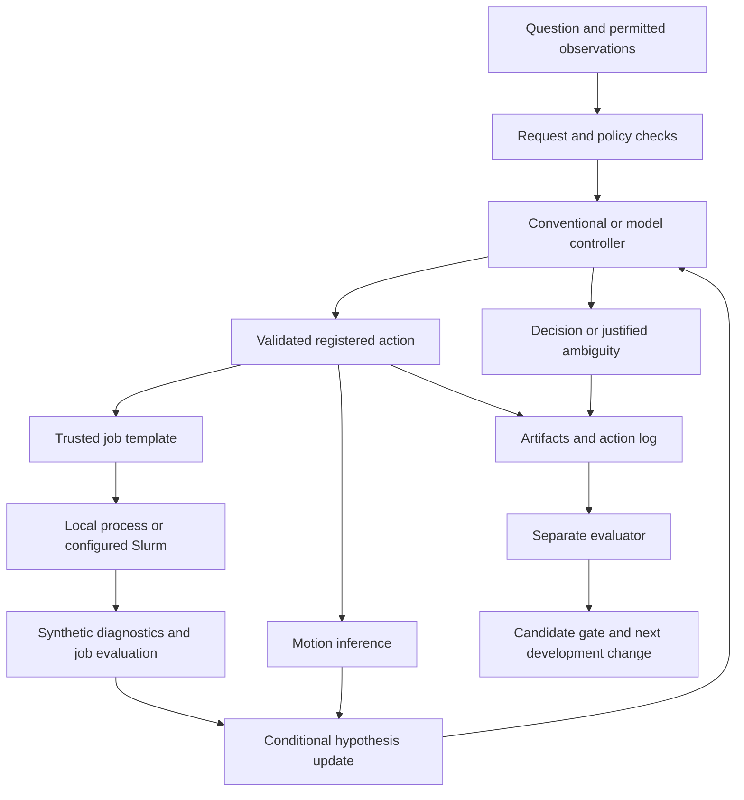

# Factor program design — implemented slice 0.3

Factor should make a scientific decision more accurate, better calibrated, reproducible or useful than the best practical alternative. A caller receives a structured result and inspectable evidence. An LLM is one replaceable controller inside that process.

The first user is an individual researcher. Data, numerical execution and artifacts stay local by default. Cloud inference and remote compute are explicit dependencies. Self-contained means the control and evaluation code can run together; it does not mean frontier weights or a cluster are bundled.

## Call path

The current job runs a prescribed-motion/corrugated-cylinder diagnostic benchmark, not MHD. Its synthetic results can test a reconstruction assumption; they cannot identify the mechanism in a supplied observation. The scalar motion input is already reconstructed displacement, not a raw PDV waveform. A real simulator and raw diagnostic importer remain explicit work.

## Interfaces and ownership

| Module | Owns | Must not own |
| --- | --- | --- |
| `contracts.py`, `motion.py` | Inputs, units, fixed-window inference and nuisance ambiguity | Evaluator labels or phase attribution |
| `runtime.py` | Actions, budgets, job ownership, public context and completion states | Model training or grading itself |
| `providers.py`, `local_models.py` | Model calls, parsing and usage | Executing returned commands or changing policy |
| `hpc.py`, `hpc_worker.py` | Fixed template, source snapshot, jobs and verified collection | Facility control or arbitrary model-supplied shell |
| `artifacts.py` | Run identity, content hashes and event chain | Proof of scientific correctness or external authenticity |
| `evaluation.py` | Frozen contract, separate truth, scoring and exposure | Supplying truth to a candidate |
| `training.py`, experiment scripts | Optional weights and reproducible adapter execution | Claiming classification improvement validates physics |
| `factory.py` | Contract-bound candidate decisions | Changing criteria after results or deploying externally |
| `liner_stability/` | Retained numerical simulation, reconstruction and utilities | Production inference through its generate-and-score workflow |

The new namespace separates workflow infrastructure from the retained numerical package. It supports one motion contract. A general task/plugin interface is proposed only after a second application tests these boundaries.

`factor.run(request, runtime=...)` returns execution status, final decision, optional numerical result, usage, jobs, hypotheses, cleanup and artifact references. `execution=completed` means the action protocol completed; it does not certify the answer. A final `ambiguous` decision can be valuable. `provider_failed`, `budget_exceeded`, `cancelled` and `failed` must not be counted as scientific abstentions. `cleanup_pending` means a decision exists but an owned job has not been confirmed stopped; inspect the durable job record before treating that run as closed.

## Inference contract

For a fixed window, `y = x + d + e`: material displacement, equivalent optical-path drift and measurement noise. Negative displacement denotes inward motion. Noise is stipulated Gaussian; drift may be bounded or unknown. An added witness `r = d + b + er` gives `y-r = x-b+e-er`. The mismatch bound on `b` and joint noise covariance require independent justification.

The bounded estimator enlarges a 95% Gaussian noise interval by the nuisance bound. Unknown drift or unknown witness mismatch produces structural ambiguity. The naive estimator assumes drift is zero. Exact ambiguity twins test whether a method guesses hidden simulator answers from indistinguishable measurements.

The reference track has extra information. Improvement there establishes its value under the assumptions, not an algorithmic win. Unseen violations of drift or mismatch bounds can defeat the estimator without a detectable symptom. Reports preserve that failure. The standalone example uses a 5 nm decision threshold; the benchmark uses 10 nm. Both require a real decision owner before operational use.

## Authority, costs and durability

Operator policy selects providers, tools, step/tool/time limits, payload size and budget. Requests cannot widen it. Cloud calls require positive budget and egress authorization; remote jobs also need an enabled cluster profile. Keys remain outside prompts and artifacts.

The cloud adapter reserves a conservative text-token estimate before a call, records reported usage and retains reservations on uncertain outcomes. Operator-supplied prices must be current. This guard is not a billing guarantee. Calls sharing one adapter cannot concurrently oversubscribe its ledger; restarting creates a new ledger, not an account-wide cap.

Calls are synchronous. Deadlines are checked between actions and passed to model calls. A blocking scheduler operation and cleanup may extend beyond the nominal deadline within their own transport bounds. This is not hard real-time execution. Each run may submit one bounded job. Owned jobs are cleaned up even after normal completion; uncertain remote submissions remain recorded for manual reconciliation before retrying.

The model has no general shell, arbitrary file reader or equipment-control tool. This application boundary is not a multi-tenant OS sandbox. A local operator can read evaluator files; truly hidden evaluation needs separate access controls and a custodian. Team authentication, shared queues and tenancy isolation are not implemented.

Run folders are exclusive. Artifact hashes and the event chain detect accidental changes, not a writer replacing the entire record. No external signatures or immutable audit service are implemented. Jobs support restart inspection; agent conversations are not automatically resumed after a crash.

## Expansion gates

1. Preserve the recovered diagnostic failure. Completed before extension.
2. Execute an observation-only loop and test the evaluator against wrong answers. Implemented.
3. Serve an actual open-weight model and compare with conventional baselines. Local experiments executed and separately reported.
4. Freeze a small failure-driven training task and evaluate held-out families. Executed for evidence classification only.
5. Verify the job lifecycle locally, then on a supplied cluster. Local verified; real Slurm pending access.
6. Compare frontier models with equal information and a fixed budget. Adapter implemented; live execution pending credentials and authorization.
7. Evaluate real diagnostic reconstruction, prospective decisions, liner transfer and another application. Proposed.

Broader backlog: raw PDV; structure tracking; synchronized multimodal timing; competing-model predictions; controlled-seed experiment selection; rod-to-liner scaling; a second domain. Each needs a task card and defensible reference truth. ETI, MRTI, phase-dependent response, current redistribution, magnetic pressure and power-flow coupling remain interacting hypotheses.

Plain-language takeaway: Factor has a small working engine whose actions can be inspected and whose mistakes can be measured. Its next expansion should earn its place with evidence.
