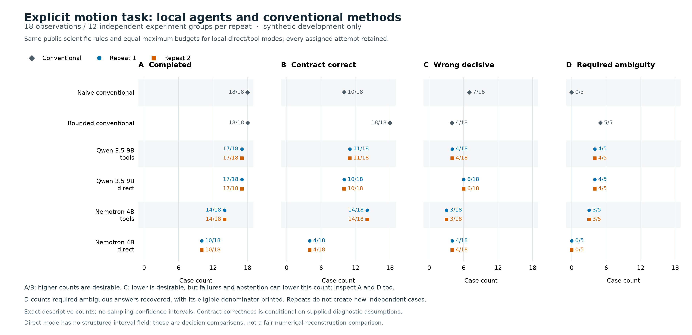

# Explicit motion-task comparison: v2

No tested AI workflow demonstrated an improvement over the bounded conventional estimator on this task. The bounded estimator made all 18 conditional decisions correctly. Nemotron 4B with tools made 14/18 correctly; Qwen 3.5 9B with tools made 11/18. All local workflows failed at least one frozen gate. The useful result is a reproducible account of where calculation, task interpretation, evidence handling, and execution fail—not a claim about intrinsic model intelligence or validated physics.

The conventional estimator itself made four physically wrong decisive decisions under deliberately hidden drift/reference mismatch. Correct execution of a conditional contract is therefore distinct from reliable inference about the actual material.

## Campaign and integrity

The [campaign](agent-v2-comparison/campaign.json) was frozen before candidate execution: development seed 20260906, 18 observations in 12 independent synthetic experiment groups, two repetitions of each of four local workflows. Every method received the explicit sign, reference, uncertainty, and decision definitions. Local modes had equal maximum budgets: six steps/calls, 120 seconds per run, and 700 output tokens per response, temperature zero, reasoning disabled, no cloud or HPC execution. Direct mode could finish; tool mode could also inspect and invoke the conventional motion calculation. No tool sequence was required.

The [completion record](agent-v2-comparison/completion.json) confirms 144 assigned attempts and no source changes during execution. An independent [trace audit](agent-v2-trace-audit.json) verified all 144 event chains, artifact hashes/identities, final-result bindings, candidate/result consistency, and source hashes against the saved snapshot. All eight local method/repeat sets had complete token accounting consistent with their recorded provider events. Hash integrity does not establish source authenticity or scientific correctness.

The [scored comparison](agent-v2-comparison/comparison.json) was read only after all candidate runs finished. This report and its summarizer do not read evaluator truth or regrade outputs. Each local workflow repeated exactly the same final decisions and execution statuses on all 18 cases. The 144 executions are **not 144 independent scientific cases**, and two repeats do not double the sample size. No final test set, human baseline, frontier model, or real measurement was evaluated.

## Results per repeat

Each local row applies separately to repeat 1 and repeat 2; their counts were identical. Failures remain in the assigned-case denominator. Required ambiguity includes four structurally ambiguous cases and one noisy-reference boundary case.

| Method | Completed | Contract correct | Required ambiguity recovered | Physically wrong decisive / all | Wrong / emitted decisive |
|---|---:|---:|---:|---:|---:|
| Naive conventional | 18/18 | 10/18 (55.6%) | 0/5 | 7/18 | 7/18 |
| Bounded conventional | 18/18 | 18/18 (100%) | 5/5 | 4/18 | 4/13 |
| Qwen 9B, tools available | 17/18 | 11/18 (61.1%) | 4/5 | 4/18 | 4/11 |
| Qwen 9B, direct | 17/18 | 10/18 (55.6%) | 4/5 | 6/18 | 6/11 |
| Nemotron 4B, tools | 14/18 | 14/18 (77.8%) | 3/5 | 3/18 | 3/11 |
| Nemotron 4B, direct | 10/18 | 4/18 (22.2%) | 0/5 | 4/18 | 4/10 |

Nemotron's smaller physical-error count with tools is not evidence of superior physical inference: one mismatch case did not finalize, so its wrong answer was never emitted. Every finalized local answer cited existing artifacts, but existing evidence did not ensure a supported conclusion.

| Regime | Cases | Bounded correct | Qwen tools | Qwen direct | Nemotron tools | Nemotron direct |
|---|---:|---:|---:|---:|---:|---:|
| Clean | 2 | 2 | 1 | 1 | 2 | 1 |
| Bounded drift | 2 | 2 | 1 | 1 | 2 | 1 |
| Unseen drift | 2 | 2 | 1 | 0 | 2 | 0 |
| Exact ambiguity | 4 | 4 | 4 | 4 | 2 | 0 |
| Calibrated reference | 4 | 4 | 2 | 2 | 3 | 1 |
| Noisy reference | 2 | 2 | 1 | 0 | 2 | 0 |
| Reference mismatch | 2 | 2 | 1 | 2 | 1 | 1 |

These are descriptive counts. No marginal confidence intervals are imputed for paired counterfactual/reference rows. Passing an empirical gate on this small sample would not establish a low population failure probability.

## What tools changed on the same cases

The following paired counts are identical in each repeat:

| Model | Both modes correct | Only tools mode correct | Only direct correct | Neither correct |
|---|---:|---:|---:|---:|
| Qwen 9B | 8 | 3 | 2 | 5 |
| Nemotron 4B | 4 | 10 | 0 | 4 |

Qwen never chose inspection or numerical inference in v2: each successful run went directly to `finish`. Its small difference between modes therefore cannot be attributed to executed numerical tools; the available-action schema and context differed. Nemotron called `infer_motion` 19 times per repeat and used its results. Its improvement includes both successful calculation and changes in evidence/execution behavior. It still did not surpass simply running the bounded conventional method. Fixed arm order, one machine, one task, quantized weights, and these interface settings limit broader model comparisons.

## Failures and observable evidence

Manual examination covered the first-repeat Qwen contract failures, representative Nemotron successes, and its failure action patterns. These examples are checks of recorded final answers and actions, not a separate validated judge score or examination of private reasoning.

- **Contradictory decision:** Qwen calculated a positive interval of approximately [13.6, 21.2] nm, explained that it rules out inward motion, but returned `compression_supported`. The public v2 definitions already made the correct label explicit. [Direct example](agent-v2-comparison/runs/run_3d6d42fb311f4179b773f9a7455c8fd3/result.json).
- **Arithmetic failure:** Qwen computed center ≈36 nm and half-width ≈9.96 nm, then reported an interval near [−64, 136] nm and abstained. The arithmetic instead gives approximately [26.0, 46.0] nm. [Tool-available example](agent-v2-comparison/runs/run_184e7bc01f634b2c826b2fe73eeb5f5f/result.json).
- **Zero confused with null:** a Qwen answer described the supplied drift bound `0.0` as null and claimed structural ambiguity. That is not detection of hidden drift; it is a misreading of the allowed observation. [Example](agent-v2-comparison/runs/run_9567c199f2634f70b2041559073e83af/result.json).
- **Useful numerical evidence:** Nemotron used the reference uncertainty and returned a conditional interval [4.24, 104.31] nm, correctly ruling out inward motion beyond −10 nm and calling for independent calibration checks. [Result](agent-v2-comparison/runs/run_d183041da3f143788bc0836b40429959/result.json) and [cited calculation](agent-v2-comparison/runs/run_d183041da3f143788bc0836b40429959/artifacts/artifact_2c37f1f28fe5dbd4b7bd7893.json).
- **A correct label does not validate every sentence:** another Nemotron result correctly chose ambiguity from unbounded nuisance, but described a 4.18 nm signal as within 1 nm noise. This illustrates why decision scoring and evidence presence do not fully validate explanations. [Example](agent-v2-comparison/runs/run_09be3e126c0d490c948ac038d956ccb7/result.json).
- **Evidence identifier/recovery failure:** Nemotron put a raw case ID into `evidence_ids` alongside a valid artifact. The runtime correctly rejected the invalid entry. Tools mode then repeatedly inspected until exhausting six steps; direct mode repeated invalid finishes. The feedback “Cite at least one artifact that actually exists in this run” is imprecise because the rule requires **all** cited IDs to exist. Better feedback and typed evidence selection are justified future changes. [Tool failure trace](agent-v2-comparison/runs/run_92f870baec4a420cbee0a5cd5dff9883/events.json), [direct failure trace](agent-v2-comparison/runs/run_126328e823ea4875aad9cfa7e12ed515/events.json).

Per repeat, Nemotron tools generated five such evidence errors, with four runs exhausting the step budget; direct generated 57 errors, with eight runs exhausting it. All invalid identifiers in those errors were raw case IDs, not nonexistent scientific sources. Failure durations were far below 120 seconds; these were six-step exhaustion events, not wall-time overruns. Historical results sometimes have null `failure` text despite `budget_exceeded`; the action/event sequence identifies the cause.

Qwen tools had one provider/action-contract failure per repeat (`Local model call failed (ContractError)`); the stored diagnostic does not establish its finer parsing cause. Qwen direct had one response reaching exactly 700 output tokens, classified `length_or_unknown` and rejected as incomplete. [Contract failure](agent-v2-comparison/runs/run_fae0aabc355b4bbe8abcc306f0258cf9/events.json), [output-limit failure](agent-v2-comparison/runs/run_60ec84db06384773800480353157017a/events.json).

## Numerical results have an interface limit

Direct mode cannot submit a structured numerical result; `finish` accepts a decision and prose, while the scored `numerical_result` is populated only by `infer_motion`. Zero scored direct intervals therefore does not measure direct numerical ability. Qwen chose no numerical calls even when available.

Nemotron produced 14 finite numerical tool artifacts per repeat, identical to the bounded calculation. Only **12** accompanied completed workflows: two additional finite results were retained from runs that exhausted their budgets before finalization. The four structurally ambiguous calculations produced no finite interval, not zero coverage.

On matched cases, the bounded method and Nemotron's calculation artifacts have MAE 2.57 nm, bias −1.31 nm, RMSE 3.01 nm, and coverage 10/10. Across all finite artifacts, coverage is 10/14: all four hidden-mismatch intervals miss the simulator truth. These are tool-artifact metrics, not proof that an agent completed every inference. The bounded method passes the provisional fixture gates; every local workflow fails completion and contract accuracy. No production approval follows from those gate booleans.

## Usage and context limits

Counts below are per repeat; latency is separately shown for repeats 1 and 2. Provider usage includes failed calls and matches the event audit.

| Workflow | Model calls | Input / output tokens | Maximum input / output per call | Total seconds, R1 / R2 |
|---|---:|---:|---:|---:|
| Qwen tools available | 18 | 30,052 / 5,001 | 1,720 / 517 | 145.13 / 145.22 |
| Qwen direct | 18 | 24,778 / 5,805 | 1,427 / 700 | 129.26 / 126.94 |
| Nemotron tools | 58 | 122,361 / 4,232 | 2,968 / 215 | 121.70 / 120.38 |
| Nemotron direct | 67 | 99,540 / 11,924 | 1,610 / 230 | 199.10 / 198.11 |

Nemotron tool actions per repeat were 19 inference calls, 20 inspections, and 19 finish attempts. Direct had 67 finish attempts. Qwen had 17 valid finishes plus one provider failure per mode. These totals describe the tested workflow, not just generation speed.

Both [Qwen](../experiments/local_model/serving_manifest.json) and [Nemotron](local-second-model/model_manifest.json) have recorded 4,096-token load configurations. The largest reported input is 2,968; even adding the common 700-token output allowance stays below 4,096. Recorded counts therefore do not suggest context overflow. The known incomplete Qwen response reached the **output** cap. The native endpoint supplies no explicit termination reason: the adapter infers completion from output length, so the trace cannot prove that the server never truncated input. No unsupported context-truncation diagnosis is made.

Local API charges were zero. Hardware, electricity, download time, and expert effort were not included; this is not a complete economic comparison. The model manifests preserve quantization and weight hashes. No frontier or human performance result is available.

## Reproduce and next decision

Run `python experiments/summarize_agent_evaluation.py` from the repository root after installing Matplotlib. It reads the saved scored comparison, candidate files, and evidence only; it makes no model calls. It regenerates `reports/agent-v2-trace-audit.json` and the PNG/PDF figure. The source comparison and immutable runs are not rewritten.

For relocated bundles, preserve `reports/agent-v2-comparison/runs/` and `source_snapshot/`, then pass `--comparison /new/location/reports/agent-v2-comparison/comparison.json` if needed. The summarizer resolves evidence inside that campaign directory by run ID, rather than following the original machine's absolute `run_path`. A relocated-copy audit verified all 144 records with candidate hashes unchanged. Original paths remain preserved as provenance.

The next increment should improve evidence identifiers/error recovery and check consistency between numerical evidence and final decisions. A separate common numerical-output interface is needed before comparing direct and tool-based reconstruction. Freeze a new campaign for any behavior change; preserve both this result and the [v1 report](AGENT_COMPARISON.md). The fresh v2 sample and changed instructions prevent treating v1–v2 score differences as a clean causal experiment.

Plain-language takeaway: tools helped the smaller model execute the stated calculation, but the complete AI workflows remained less dependable than the conventional baseline. Neither calculation nor fluent explanation resolves a diagnostic ambiguity that the observations cannot identify.
