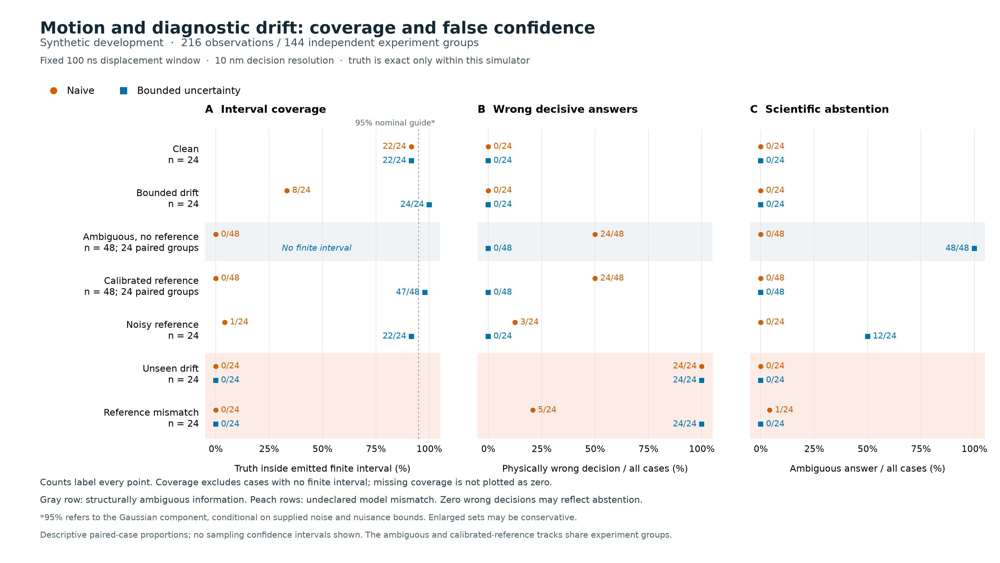

# Factor 0.3 build report

Factor is now a callable scientific environment with executed local model evaluations, actual small-model post-training, a working simulation-job loop and a packaged Python distribution. **120 implementation tests pass.** This is a development release: no live frontier API, remote HPC, human baseline or independent real-data result is claimed.

The active repository extends the recovered 0.2 Git history. The Desktop original remains unchanged. Its 33 tests and 240 synthetic cases were reproduced before extension; the preserved optical-drift failure was 0/40 compression-depth intervals covering truth. [Original reproduction](original-v0.2.0/comparison.json).

## Agentic scientific workflow

The environment accepts a question and permitted observations, validates a bounded agent action, runs registered numerical tools or a fixed simulation job, collects diagnostic artifacts, records conditional hypotheses and returns a structured decision. Python callers use `factor.run`; the CLI uses the same runtime. Requests cannot widen the operator's permissions. A candidate's unsupported answer remains visible to the evaluator.

A real locally served Qwen3.5-9B instance completed request → job → diagnostic → inference → hypothesis → decision in **seven actions and 56.337 seconds**, including a **12-case local numerical job**. Its correct final answer was ambiguity under unknown optical drift. This was a guided integration demonstration, not an autonomous scientific discovery or a real cluster run. [Independent loop audit](CLOSED_LOOP_REPORT.md).

The completed v2 evaluation froze 18 cases from 12 independent experiment groups and compared two local models with and without tools, twice each: **144 assigned attempts**, with failures retained. Every repeat produced the same final decisions and completion statuses. Repeats are not additional independent experiments.

| Method | Correct contract decisions, per repeat | Completed, per repeat |
| --- | ---: | ---: |
| Conventional bounded estimator | 18/18 | 18/18 |
| Conventional naive estimator | 10/18 | 18/18 |
| Qwen3.5-9B, tools available | 11/18 | 17/18 |
| Qwen3.5-9B, direct | 10/18 | 17/18 |
| Nemotron-3-Nano-4B, tools available | 14/18 | 14/18 |
| Nemotron-3-Nano-4B, direct | 4/18 | 10/18 |

The conventional baselines are deterministic and were scored once. Each model arm received the same public observations, decision rules and resource ceilings. Tool availability is the intervention. Qwen did not choose the inference tool in this campaign. Nemotron's tool-enabled completions followed the contract, but four assigned runs failed to complete. All 144 result bindings, event chains and artifact records passed the integrity audit; the source did not change during execution. [Full v2 comparison, costs and failures](AGENT_V2_COMPARISON.md).

These results support a narrow conclusion: this tool interface helped the tested Nemotron workflow on these cases. Neither local model outperformed the conventional estimator on contract decisions. Model size alone did not predict performance. Direct mode cannot emit structured numerical intervals through its final-answer interface, so this is a decision comparison, not a fair direct-versus-tool comparison of numerical reconstruction accuracy. The first v1 campaign had incomplete public sign/label rules and unequal step budgets; it remains a documented interface failure rather than evidence of model inferiority. [Preserved v1 audit](AGENT_COMPARISON.md).

## Scientific failures remain visible

Contract correctness means following the supplied assumptions; it is not physical correctness. In v2, the bounded estimator made **four wrong decisive physical conclusions in four hidden-mismatch cases**, despite 18/18 correct conditional contract decisions. Their intervals covered truth 0/4 times. The inputs gave no reliable way to detect those violations.

The larger 216-case conventional development evaluation likewise preserves complete failure under undeclared optical drift and reference mismatch. It also demonstrates appropriate ambiguity when drift is explicitly unconstrained, and better recovery with a calibrated reference under its stated limits. This fixed-window scalar task is different from the original minimum-compression-depth reconstruction. [Failure-focused baseline report](motion-development/BASELINE_REPORT.md).

All of these data are synthetic. The numerical job prescribes motion and generates simplified diagnostics; it is not an MHD solver. This work does not establish melting, ETI, MRTI, a common mechanism between separate experiments, or transfer from rods to imploding liners.

## Actual local weights and post-training

Qwen3.5-9B and Nemotron-3-Nano-4B quantized weights were served locally. Model identities, file hashes, settings, token usage and observable actions are saved. Early output-routing failures and usable-but-wrong answers are retained.

A separate **Qwen3-0.6B model was actually post-trained with generative LoRA on this Mac**, using 192 authored training examples and development-only checkpoint selection. On the frozen 48-example test across four held-out families, evidence-provenance classification improved from **15/48 (31.25%) to 33/48 (68.75%)**: 20 improvements, two regressions and 15 remaining errors. The completed process took 81.9 seconds. The selected adapter was reloaded and exercised through the optional package interface.

This is one training seed and a narrow classification task, with only four independent test families. It is not evidence of improved physics reasoning or scientific decisions. The test is now exposed; further tuning needs new evaluation material. The release includes the small adapter, training recipe, frozen data, predictions and hashes. Base weights require a separate explicit, verified download. [Weights, inference, serving and training instructions](../docs/LOCAL_MODELS.md).

## Verification and product boundary

The **120-test suite passed in 15.565 seconds**. Tests cover the original numerical code, evaluator negative controls, input contracts, local model transport, cost and tool boundaries, job lifecycle, artifact integrity, candidate gates and training metadata. A wheel was built and installed into a separate environment; both CLIs, a conventional request and v2 evaluation were exercised outside the source tree. The installed package and wheel contain the same 30 Python files as current source. [Verification record and wheel hash](verification-final/REPORT.md).

The OpenAI Responses adapter, disabled-by-default cloud profiles, Slurm job connector and deterministic candidate gates are implemented. Live provider and scheduler behavior remains unverified. The factory currently records evidence-based candidate decisions locally; automatic code generation, unbounded self-modification and production deployment are not implemented. Shared-team authentication, hard process isolation and automatic recovery of interrupted agent conversations are later work.

The next local workflow fix is concrete: when a candidate mixes a valid artifact ID with an invalid case ID, the runtime rejects the answer but its error does not clearly identify the invalid entry. A future revision should improve that feedback and be measured on newly frozen cases. The completed campaign remains unchanged.

## Next steps that require external access

- **Frontier comparison:** a permitted API project/key configured locally, explicit model IDs, verified prices and an authorized total spending cap. [API configuration](../docs/FRONTIER_APIS.md).
- **Real HPC:** cluster hostname, scheduler/account/partition, existing Python environment and resource/runtime ceilings. The local lifecycle is tested; the remote profile remains disabled. [HPC configuration](../docs/HPC.md).
- **Real diagnostic validation:** one complete measurement record with timing, calibration, geometry and pre-shot metrology, plus the decision precision that matters scientifically.

The requested interview's automatic captions were retrieved and inspected for relevant passages. [Timestamped paraphrases and sources](../docs/VIDEO_WORKFLOW_NOTES.md) explain the design choices; the full copyrighted transcript is not redistributed.

Plain-language takeaway: Factor can now run a small scientific workflow, measure its failures and reproduce a narrow training improvement. Trust still depends on valid measurements and assumptions. Real frontier and cluster runs are the next integration steps; scientific validation remains a separate obligation.
